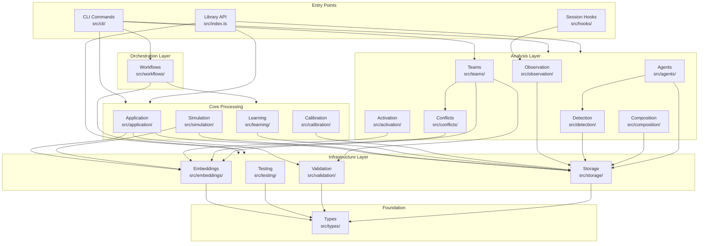

# Architecture Overview

This documentation covers the internal architecture of `gsd-skill-creator` for contributors working on the codebase and library consumers building integrations.

## Layered Design Philosophy

The codebase follows a strict layered architecture where dependencies flow downward only. Lower layers (types, storage) have no dependencies on higher layers (CLI, workflows). This enables:

- **Testability**: Each layer can be tested in isolation
- **Reusability**: Core modules work independently of CLI
- **Maintainability**: Changes in one layer don't ripple upward

## Combined Data Flow Diagram

## Quick Navigation

| Document | Purpose |
|----------|---------|
| [layers.md](layers.md) | Comprehensive 12+ layer module documentation with dependency matrix |
| [data-flows.md](data-flows.md) | Per-operation data flow diagrams |
| [storage.md](storage.md) | Storage locations and file formats |
| [extending.md](extending.md) | Extension points and customization |

## Related Documentation

For learning-oriented documentation, see:

- [Getting Started](../GETTING-STARTED.md) - Installation and quickstart
- [Workflows](../WORKFLOWS.md) - Common usage patterns
- [Tutorials](../tutorials/) - Step-by-step guides:
  - [Skill Creation](../tutorials/skill-creation.md)
  - [Conflict Detection](../tutorials/conflict-detection.md)
  - [Calibration](../tutorials/calibration.md)
  - [CI Integration](../tutorials/ci-integration.md)
- [Examples](../../examples/) - Ready-to-use skill templates

For reference documentation:

- [API.md](../API.md) - Complete programmatic API reference
- [CLI.md](../CLI.md) - Command-line interface reference
- [GSD-TEAMS.md](../GSD-TEAMS.md) - GSD teams vs subagents decision guide
- [CHANGELOG.md](../CHANGELOG.md) - Version history and changes
