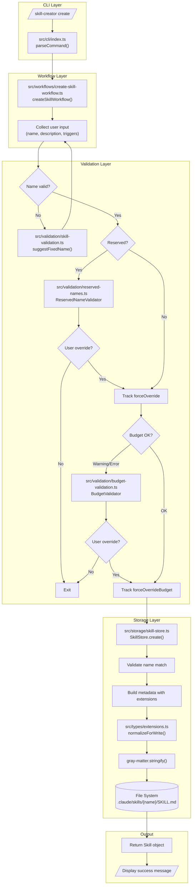
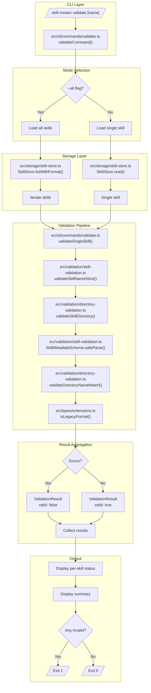
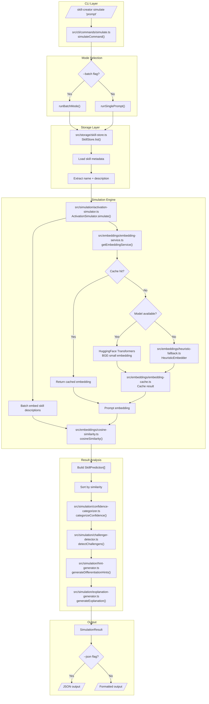
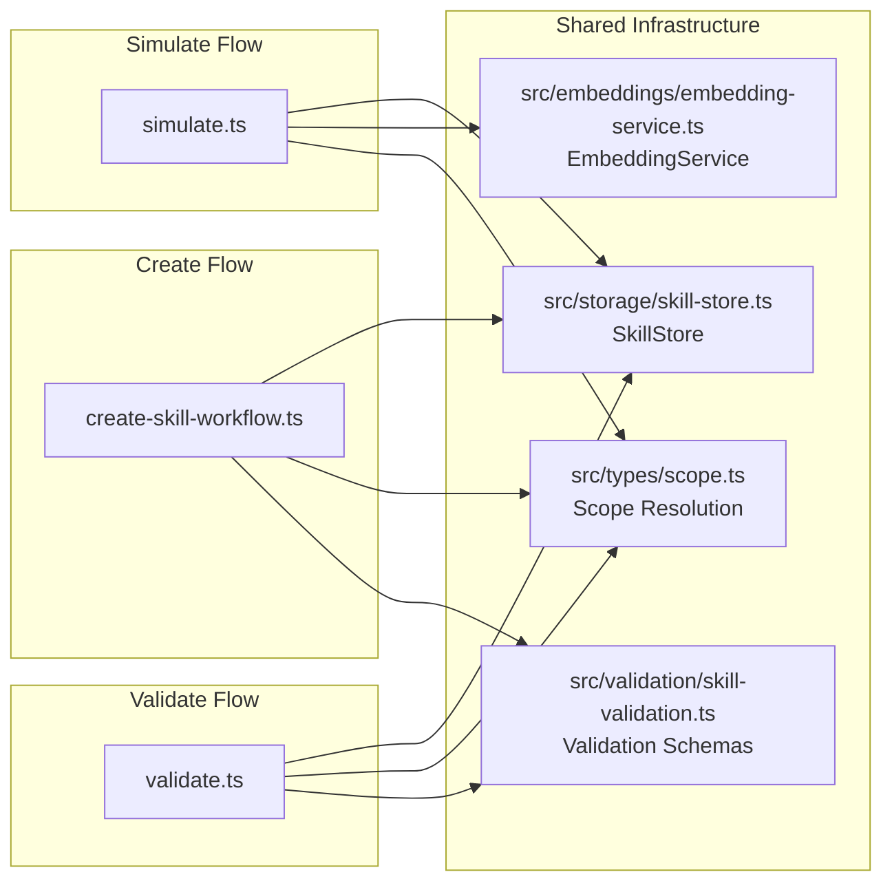

# Data Flow Diagrams

This document details how data moves through gsd-skill-creator for the three core operations: **create**, **validate**, and **simulate**. Each flow shows the complete path from CLI invocation to completion.

## How to Read These Diagrams

- **Nodes** represent source files (with paths like `src/module/file.ts`)
- **Arrows** show data/control flow direction
- **Labels** on arrows describe what data is passed
- **Dashed lines** indicate optional or conditional paths
- **Subgraphs** group related modules by layer

## Diagram Conventions

| Symbol | Meaning |
|--------|---------|
| `[Rectangle]` | Function or class |
| `[(Database)]` | File system storage |
| `{Diamond}` | Decision point |
| `-->` | Required data flow |
| `-.->` | Optional/conditional flow |

---

## 1. Create Skill Flow

The create flow handles new skill authoring through an interactive workflow, with validation gates at multiple points.



### Create Flow Details

**1. CLI Entry (`src/cli/index.ts`)**

The CLI parses the `create` command and determines the target scope (user or project):

```typescript
// Scope resolution
const scope = parseScope(args);  // src/types/scope.ts
const basePath = getSkillsBasePath(scope);
```

**2. Workflow Orchestration (`src/workflows/create-skill-workflow.ts`)**

The workflow collects user input through interactive prompts using `@clack/prompts`:

- Skill name (validated in real-time)
- Description (checked for activation patterns)
- Enabled state
- Optional trigger conditions (intents, files, contexts)
- Markdown content

**3. Validation Gates**

Three validation checkpoints before persistence:

| Gate | Module | Purpose |
|------|--------|---------|
| Name | `src/validation/skill-validation.ts` | Enforces Claude Code naming spec |
| Reserved | `src/validation/reserved-names.ts` | Blocks built-in command names |
| Budget | `src/validation/budget-validation.ts` | Prevents context overflow |

**4. Storage (`src/storage/skill-store.ts`)**

The SkillStore performs final validation and writes:

```typescript
// Key operations in SkillStore.create()
validateSkillNameStrict(skillName);      // Name validation
validateReservedName(skillName);          // Reserved check
normalizeForWrite(metadata);              // Extension format
matter.stringify(body, diskMetadata);     // Frontmatter generation
writeFile(skillPath, content);            // Persist to disk
```

**5. File System Output**

Creates the skill directory structure:

```
.claude/skills/{name}/
  SKILL.md           # Frontmatter + body
```

---

## 2. Validate Skill Flow

The validate flow performs comprehensive quality checks on existing skills, supporting both single-skill and batch validation modes.



### Validate Flow Details

**1. CLI Entry (`src/cli/commands/validate.ts`)**

Two modes of operation:

```bash
skill-creator validate my-skill     # Single skill
skill-creator validate --all        # All skills
```

**2. Skill Discovery**

For batch mode, `listWithFormat()` returns both current and legacy format skills:

```typescript
interface SkillInfo {
  name: string;
  format: 'current' | 'legacy';
  path: string;
}
```

**3. Validation Pipeline**

Each skill passes through four validation stages:

| Stage | Module | Checks |
|-------|--------|--------|
| 1. Name | `src/validation/skill-validation.ts` | Length, characters, pattern |
| 2. Directory | `src/validation/directory-validation.ts` | SKILL.md location, structure |
| 3. Schema | `src/validation/skill-validation.ts` | Zod schema validation |
| 4. Name Match | `src/validation/directory-validation.ts` | Directory matches frontmatter |

**4. Result Structure**

```typescript
interface ValidationResult {
  name: string;
  valid: boolean;
  errors: string[];
  warnings: string[];
  format: 'current' | 'legacy';
}
```

**5. Exit Codes**

- `0`: All skills valid
- `1`: One or more validation failures

---

## 3. Simulate Activation Flow

The simulate flow predicts which skill would activate for a given user prompt using semantic similarity from embeddings.



### Simulate Flow Details

**1. CLI Entry (`src/cli/commands/simulate.ts`)**

Supports single prompt and batch modes:

```bash
skill-creator simulate "commit my changes"           # Single
skill-creator simulate --batch prompts.txt           # Batch
skill-creator simulate "prompt" --verbose --json     # With options
```

**2. Skill Loading**

Skills are loaded from the configured scope and converted to simulation input:

```typescript
interface SkillInput {
  name: string;
  description: string;
}
```

**3. Embedding Pipeline (`src/embeddings/`)**

The embedding service uses a three-tier strategy:

| Tier | Source | When Used |
|------|--------|-----------|
| 1 | Cache | Content hash matches cached entry |
| 2 | Model | HuggingFace BGE-small available |
| 3 | Heuristic | Model unavailable (TF-IDF fallback) |

**4. Similarity Computation**

```typescript
// For each skill
const similarity = cosineSimilarity(promptEmbedding, skillEmbedding);
const prediction: SkillPrediction = {
  skillName: skill.name,
  similarity,
  confidence: similarity * 100,
  confidenceLevel: categorizeConfidence(similarity),
  wouldActivate: similarity >= threshold
};
```

**5. Result Analysis**

Multiple analysis modules process the raw predictions:

| Module | Purpose |
|--------|---------|
| `confidence-categorizer.ts` | Map similarity to confidence levels |
| `challenger-detector.ts` | Find close competitors |
| `hint-generator.ts` | Suggest description improvements |
| `explanation-generator.ts` | Natural language explanation |

**6. Output Structure**

```typescript
interface SimulationResult {
  prompt: string;
  winner: SkillPrediction | null;
  challengers: SkillPrediction[];
  allPredictions: SkillPrediction[];
  explanation: string;
  method: 'model' | 'heuristic';
  trace?: SimulationTrace;
}
```

---

## Key Integration Points

The three flows share several components that provide consistent behavior across operations.

### Shared Components



### Integration Summary

| Component | Create | Validate | Simulate |
|-----------|--------|----------|----------|
| `SkillStore` | Write skills | Read skills | Read metadata |
| `EmbeddingService` | - | - | Generate embeddings |
| `Scope Resolution` | Target directory | Target directory | Target directory |
| `Validation Schemas` | Input validation | Full validation | - |

---

## See Also

- [Layers Overview](./layers.md) - Module responsibilities by architectural layer
- [API Reference](../API.md) - Complete function signatures
- [CLI Reference](../CLI.md) - Command options and usage
