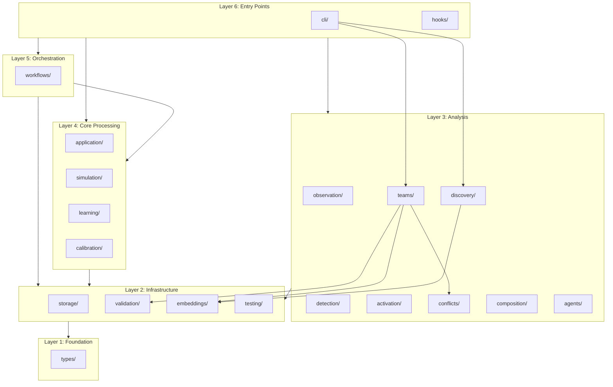

# Module Architecture

This document provides a comprehensive reference for all modules in the `gsd-skill-creator` codebase. Each layer is documented with its responsibilities, key files, exports, dependencies, and rationale.

## Layered Architecture Philosophy

The codebase follows a strict dependency hierarchy where modules only depend on layers below them:

1. **Foundation**: Types define the data structures used everywhere
2. **Infrastructure**: Storage, validation, embeddings provide core services
3. **Analysis**: Detection, observation, conflicts analyze skill data
4. **Core Processing**: Application, simulation, learning perform operations
5. **Orchestration**: Workflows combine multiple operations
6. **Entry Points**: CLI and hooks expose functionality to users

This structure ensures:
- Lower layers are stable and reusable
- Higher layers can be modified without affecting foundations
- Testing can focus on isolated layer behavior

## Dependency Matrix

Quick reference showing which layers depend on which.

| Layer | types | storage | validation | embeddings | testing | observation | detection | activation | conflicts | composition | agents | teams | discovery | application | simulation | learning | calibration | workflows | cli | hooks |
|-------|:-----:|:-------:|:----------:|:----------:|:-------:|:-----------:|:---------:|:----------:|:---------:|:-----------:|:------:|:-----:|:---------:|:-----------:|:----------:|:--------:|:-----------:|:---------:|:---:|:-----:|
| **types** | - | | | | | | | | | | | | | | | | | | | |
| **storage** | Y | - | | | | | | | | | | | | | | | | | | |
| **validation** | Y | | - | | | | | | | | | | | | | | | | | |
| **embeddings** | Y | | | - | | | | | | | | | | | | | | | | |
| **testing** | Y | Y | Y | Y | - | | | | | | | | | | | | | | | |
| **observation** | Y | Y | | | | - | | | | | | | | | | | | | | |
| **detection** | Y | Y | | | | | - | | | | | | | | | | | | | |
| **activation** | Y | | | Y | | | | - | | | | | | | | | | | | |
| **conflicts** | Y | | | Y | | | | | - | | | | | | | | | | | |
| **composition** | Y | Y | | | | | | | | - | | | | | | | | | | |
| **agents** | Y | Y | | | | | Y | | | | - | | | | | | | | | |
| **teams** | Y | | Y | Y | | | | | Y | | | - | | | | | | | | |
| **discovery** | | | | Y | | | | | | | | | - | | | | | | | |
| **application** | Y | Y | Y | Y | | | | | | | | | | - | | | | | | |
| **simulation** | Y | Y | | Y | | | | | | | | | | | - | | | | | |
| **learning** | Y | Y | | | | | | | | | | | | | | - | | | | |
| **calibration** | Y | Y | | | | | | | | | | | | | | | - | | | |
| **workflows** | Y | Y | Y | | | | | | | | | | | | | | | - | | |
| **cli** | Y | Y | Y | Y | Y | | Y | Y | Y | Y | Y | Y | Y | | Y | Y | Y | | - | |
| **hooks** | Y | | | | | Y | | | | | | | | | | | | | | - |

**Legend:** Y = depends on, - = self, empty = no dependency

## Layer Diagram

---

## Layer 1: Foundation

### types/

**Responsibility:** Define all TypeScript interfaces, types, and constants used across the codebase.

**Key Files:**

| File | Purpose |
|------|---------|
| `skill.ts` | Skill metadata, triggers, learning structures |
| `pattern.ts` | Pattern categories for observation data |
| `scope.ts` | Skill scope (user vs project) utilities |
| `application.ts` | Token counting, scoring, session types |
| `learning.ts` | Feedback, refinement, versioning types |
| `detection.ts` | Skill candidate detection types |
| `observation.ts` | Session observation structures |
| `conflicts.ts` | Conflict detection configuration |
| `embeddings.ts` | Embedding vectors and cache types |
| `simulation.ts` | Simulation result types |
| `testing.ts` | Test case and result types |
| `test-run.ts` | Test run execution types |
| `activation.ts` | Activation scoring types |
| `agent.ts` | Agent configuration types |
| `extensions.ts` | GSD extension metadata format |

**Key Exports:**

| Export | Type | Description |
|--------|------|-------------|
| `Skill` | Interface | Complete skill with metadata and body |
| `SkillMetadata` | Interface | Skill YAML frontmatter structure |
| `SkillTrigger` | Interface | Trigger conditions (intents, files, contexts) |
| `Pattern` | Interface | Observed pattern with timestamp and category |
| `SkillScope` | Type | `'user' \| 'project'` scope discriminator |
| `getSkillsBasePath()` | Function | Get skills directory for scope |
| `validateSkillName()` | Function | Validate name against spec |
| `OFFICIAL_NAME_PATTERN` | RegExp | Official Claude Code name pattern |

**Depends On:** None

**Used By:** All other modules

**Rationale:** Centralizing type definitions prevents circular dependencies and ensures consistency across the codebase. Any module can import types without pulling in implementation code.

---

## Layer 2: Infrastructure

### storage/

**Responsibility:** Provide CRUD operations for skills and patterns, plus in-memory indexing for fast lookup.

**Key Files:**

| File | Purpose |
|------|---------|
| `skill-store.ts` | Create, read, update, delete skill files |
| `skill-index.ts` | In-memory index with search and filtering |
| `pattern-store.ts` | Append-only JSONL pattern storage |

**Key Exports:**

| Export | Type | Description |
|--------|------|-------------|
| `SkillStore` | Class | Skill file CRUD operations |
| `SkillIndex` | Class | Fast in-memory skill lookup |
| `PatternStore` | Class | Pattern persistence (JSONL) |
| `listAllScopes()` | Function | List available skill scopes |
| `SkillIndexEntry` | Interface | Index entry with metadata snapshot |
| `ScopedSkillEntry` | Interface | Entry with scope and conflict info |

**Depends On:** `types/`

**Used By:** `observation/`, `detection/`, `composition/`, `agents/`, `application/`, `simulation/`, `learning/`, `calibration/`, `workflows/`, `cli/`

**Rationale:** Abstracting storage behind classes allows the rest of the codebase to work with skills without knowing file system details. The index provides O(1) lookups for common operations.

---

### validation/

**Responsibility:** Validate skill input, names, budgets, directory structure, and reserved names against official specifications.

**Key Files:**

| File | Purpose |
|------|---------|
| `skill-validation.ts` | Zod schemas for skill input validation |
| `budget-validation.ts` | Token budget limit validation |
| `directory-validation.ts` | Skill directory structure validation |
| `reserved-names.ts` | Reserved name collision detection |
| `agent-validation.ts` | Agent configuration validation |
| `test-validation.ts` | Test case input validation |

**Key Exports:**

| Export | Type | Description |
|--------|------|-------------|
| `SkillInputSchema` | Zod Schema | Complete skill input validation |
| `SkillNameSchema` | Zod Schema | Name validation rules |
| `TriggerPatternsSchema` | Zod Schema | Trigger pattern validation |
| `validateSkillInput()` | Function | Validate skill input data |
| `validateSkillUpdate()` | Function | Validate partial updates |
| `validateDescriptionQuality()` | Function | Check activation patterns |
| `suggestFixedName()` | Function | Suggest valid name alternatives |
| `BudgetValidator` | Class | Token budget enforcement |
| `ReservedNameValidator` | Class | Reserved name checking |

**Depends On:** `types/`

**Used By:** `storage/`, `testing/`, `application/`, `workflows/`, `cli/`

**Rationale:** Validation is a cross-cutting concern used by multiple layers. Centralizing it ensures consistent enforcement of Claude Code specifications and prevents invalid data from entering the system.

---

### embeddings/

**Responsibility:** Generate and cache semantic embeddings for similarity analysis using HuggingFace models with TF-IDF fallback.

**Key Files:**

| File | Purpose |
|------|---------|
| `embedding-service.ts` | Main service with model loading and caching |
| `embedding-cache.ts` | Content-hash based cache with invalidation |
| `heuristic-fallback.ts` | TF-IDF based fallback when model unavailable |
| `cosine-similarity.ts` | Vector similarity calculation |

**Key Exports:**

| Export | Type | Description |
|--------|------|-------------|
| `EmbeddingService` | Class | Main embedding generation service |
| `getEmbeddingService()` | Function | Get singleton service instance |
| `EmbeddingCache` | Class | Cache with content-hash invalidation |
| `HeuristicEmbedder` | Class | TF-IDF fallback embedder |
| `cosineSimilarity()` | Function | Calculate vector similarity |
| `EmbeddingVector` | Type | Float32 array of embedding values |

**Depends On:** `types/`

**Used By:** `activation/`, `conflicts/`, `simulation/`, `application/`, `cli/`

**Rationale:** Semantic similarity is core to conflict detection and simulation. Isolating embedding infrastructure allows swapping models or adding new embedding strategies without changing consumers.

---

### testing/

**Responsibility:** Provide test case storage, execution, and result formatting for skill validation.

**Key Files:**

| File | Purpose |
|------|---------|
| `test-store.ts` | Persist test cases per skill |
| `result-store.ts` | Store test run results |
| `test-runner.ts` | Execute test suites |
| `result-formatter.ts` | Format results for terminal and JSON |
| `review-workflow.ts` | Interactive test case review |
| `generators/` | Auto-generate test cases |

**Key Exports:**

| Export | Type | Description |
|--------|------|-------------|
| `TestStore` | Class | Test case persistence |
| `ResultStore` | Class | Test run result storage |
| `TestRunner` | Class | Test execution orchestration |
| `ResultFormatter` | Class | Result display formatting |
| `formatTestResults()` | Function | Format for terminal output |
| `formatJSON()` | Function | Format for CI/JSON output |
| `ReviewWorkflow` | Class | Interactive review flow |
| `TestCase` | Interface | Test case definition |
| `TestRunResult` | Interface | Complete run result |

**Depends On:** `types/`, `storage/`, `validation/`, `embeddings/`

**Used By:** `cli/`

**Rationale:** Testing is isolated from the main skill runtime to allow independent development of test features without affecting skill application. The test infrastructure can evolve separately from core skill processing.

---

## Layer 3: Analysis

### observation/

**Responsibility:** Parse Claude Code session transcripts and extract behavioral patterns for skill suggestion.

**Key Files:**

| File | Purpose |
|------|---------|
| `session-observer.ts` | Orchestrate session start/end handling |
| `transcript-parser.ts` | Parse JSONL transcript files |
| `pattern-summarizer.ts` | Summarize session patterns |
| `retention-manager.ts` | Prune old patterns based on retention config |

**Key Exports:**

| Export | Type | Description |
|--------|------|-------------|
| `SessionObserver` | Class | Main observation orchestrator |
| `TranscriptParser` | Class | Parse transcript files |
| `PatternSummarizer` | Class | Summarize patterns |
| `RetentionManager` | Class | Pattern retention management |
| `parseTranscript()` | Function | Convenience parser function |
| `summarizeSession()` | Function | Convenience summarizer |
| `SessionStartData` | Interface | Hook start payload |
| `SessionEndData` | Interface | Hook end payload |

**Depends On:** `types/`, `storage/`

**Used By:** `hooks/`

**Rationale:** Observation is the input pipeline for learning. Separating it allows the system to evolve how it captures user behavior without changing downstream pattern analysis.

---

### detection/

**Responsibility:** Analyze observed patterns to identify skill candidates and generate skill suggestions.

**Key Files:**

| File | Purpose |
|------|---------|
| `pattern-analyzer.ts` | Stream sessions and identify candidates |
| `suggestion-store.ts` | Persist skill suggestions |
| `skill-generator.ts` | Generate skill markdown from candidates |
| `suggestion-manager.ts` | Manage suggestion lifecycle |

**Key Exports:**

| Export | Type | Description |
|--------|------|-------------|
| `PatternAnalyzer` | Class | Analyze patterns for candidates |
| `SuggestionStore` | Class | Persist suggestions |
| `SkillGenerator` | Class | Generate skill files |
| `SuggestionManager` | Class | Full suggestion workflow |
| `GeneratedSkill` | Interface | Generated skill output |
| `DetectionResult` | Interface | Detection operation result |

**Depends On:** `types/`, `storage/`

**Used By:** `agents/`, `cli/`

**Rationale:** Detection transforms raw observations into actionable skill suggestions. Isolating it allows experimentation with detection algorithms without affecting observation or storage.

---

### activation/

**Responsibility:** Score skill activation likelihood and suggest improvements for better triggering.

**Key Files:**

| File | Purpose |
|------|---------|
| `activation-scorer.ts` | Score description activation likelihood |
| `activation-formatter.ts` | Format scores for display |
| `activation-suggester.ts` | Suggest activation improvements |
| `llm-activation-analyzer.ts` | Optional LLM-based deep analysis |

**Key Exports:**

| Export | Type | Description |
|--------|------|-------------|
| `ActivationScorer` | Class | Local activation scoring |
| `ActivationFormatter` | Class | Score display formatting |
| `ActivationSuggester` | Class | Improvement suggestions |
| `LLMActivationAnalyzer` | Class | LLM-based analysis |
| `ActivationSuggestion` | Interface | Suggested improvement |
| `FormatOptions` | Interface | Formatting configuration |

**Depends On:** `types/`, `embeddings/`

**Used By:** `cli/`

**Rationale:** Activation scoring helps users write better skill descriptions. Isolating it allows the scoring algorithm to evolve independently from the rest of the system.

---

### conflicts/

**Responsibility:** Detect semantic conflicts between skills and suggest rewrites to differentiate them.

**Key Files:**

| File | Purpose |
|------|---------|
| `conflict-detector.ts` | Embedding-based conflict detection |
| `conflict-formatter.ts` | Format conflicts for CLI output |
| `rewrite-suggester.ts` | Suggest description rewrites |

**Key Exports:**

| Export | Type | Description |
|--------|------|-------------|
| `ConflictDetector` | Class | Detect skill conflicts |
| `ConflictFormatter` | Class | Format conflict output |
| `RewriteSuggester` | Class | Generate rewrite suggestions |
| `ConflictConfig` | Interface | Detection configuration |
| `ConflictPair` | Interface | Two conflicting skills |
| `ConflictResult` | Interface | Detection result |
| `RewriteSuggestion` | Interface | Suggested rewrite |

**Depends On:** `types/`, `embeddings/`

**Used By:** `cli/`

**Rationale:** Conflict detection prevents skills from competing for the same triggers. Separating it allows the similarity algorithm to be tuned without affecting other features.

---

### composition/

**Responsibility:** Manage skill inheritance and resolve skill dependencies across scopes.

**Key Files:**

| File | Purpose |
|------|---------|
| `dependency-graph.ts` | Build and traverse skill dependency graph |
| `skill-resolver.ts` | Resolve skill inheritance chains |

**Key Exports:**

| Export | Type | Description |
|--------|------|-------------|
| `DependencyGraph` | Class | Skill dependency management |
| `SkillResolver` | Class | Resolve inheritance |
| `DependencyResult` | Interface | Graph traversal result |
| `SkillResolution` | Interface | Resolved skill chain |

**Depends On:** `types/`, `storage/`

**Used By:** (internal composition operations)

**Rationale:** Skill composition enables inheritance and extension. Isolating it allows the inheritance model to evolve without affecting basic skill storage.

---

### agents/

**Responsibility:** Detect skill clusters and suggest agent compositions from co-activation patterns.

**Key Files:**

| File | Purpose |
|------|---------|
| `co-activation-tracker.ts` | Track skills activated together |
| `cluster-detector.ts` | Detect skill clusters |
| `agent-generator.ts` | Generate agent configurations |
| `agent-suggestion-manager.ts` | Manage agent suggestions |

**Key Exports:**

| Export | Type | Description |
|--------|------|-------------|
| `CoActivationTracker` | Class | Track co-activations |
| `ClusterDetector` | Class | Detect skill clusters |
| `AgentGenerator` | Class | Generate agents |
| `AgentSuggestionManager` | Class | Manage agent suggestions |
| `SkillCluster` | Interface | Cluster of related skills |
| `GeneratedAgent` | Interface | Generated agent config |
| `AgentSuggestion` | Interface | Agent suggestion |

**Depends On:** `types/`, `storage/`, `detection/`

**Used By:** `cli/`

**Rationale:** Agent suggestion is a higher-level feature built on skill detection. Separating it allows agent composition logic to evolve independently.

---

### teams/

**Responsibility:** Manage team configurations including template generation, persistence, creation wizards, and comprehensive validation (schema, topology, agent resolution, cycle detection, tool overlap, skill conflicts, role coherence).

**Key Files:**

| File | Purpose |
|------|---------|
| `templates.ts` | Leader/worker, pipeline, and swarm pattern template generators |
| `gsd-templates.ts` | GSD-specific research and debugging team template generators |
| `team-store.ts` | Team config CRUD (read, write, list, delete) with scope support |
| `team-agent-generator.ts` | Generate agent markdown files from team member definitions |
| `team-wizard.ts` | Interactive and non-interactive team creation workflow |
| `team-validator.ts` | Full validation orchestrator: agent resolution, cycles, tool overlap, skill conflicts, role coherence |
| `index.ts` | Barrel export for all teams/ public API |

**Key Exports:**

| Export | Type | Description |
|--------|------|-------------|
| `TeamStore` | Class | Team config persistence (project/user scope) |
| `getTeamsBasePath()` | Function | Get teams directory for scope |
| `getAgentsBasePath()` | Function | Get agents directory path |
| `generateLeaderWorkerTemplate()` | Function | Generate leader/worker team config |
| `generatePipelineTemplate()` | Function | Generate pipeline team config |
| `generateSwarmTemplate()` | Function | Generate swarm team config |
| `generateGsdResearchTeam()` | Function | Generate GSD parallel research team |
| `generateGsdDebuggingTeam()` | Function | Generate GSD adversarial debugging team |
| `teamCreationWizard()` | Function | Interactive team creation flow |
| `nonInteractiveCreate()` | Function | Non-interactive team creation |
| `writeTeamAgentFiles()` | Function | Write agent .md files for team members |
| `validateTeamFull()` | Function | Full 7-check team validation orchestrator |
| `validateMemberAgents()` | Function | Check agent files exist on disk |
| `detectTaskCycles()` | Function | Detect circular task dependencies |
| `detectToolOverlap()` | Function | Find shared write-capable tools |
| `detectSkillConflicts()` | Function | Cross-member skill overlap detection |
| `detectRoleCoherence()` | Function | Near-duplicate description warnings |

**Depends On:** `types/`, `validation/`, `embeddings/`, `conflicts/`

**Used By:** `cli/`

**Rationale:** Teams group multiple agents into coordinated units with shared task management. Isolating team logic allows template patterns, validation rules, and persistence to evolve independently from individual agent or skill management.

---

### discovery/

**Responsibility:** Scan Claude Code session logs, extract recurring patterns, cluster similar prompts, rank candidates, and generate draft skills.

**Key Files:**

| File | Purpose |
|------|---------|
| `types.ts` | Zod schemas for JSONL session format (7 entry types) |
| `session-parser.ts` | Streaming line-by-line JSONL parser |
| `session-enumerator.ts` | Session enumeration from sessions-index.json |
| `user-prompt-classifier.ts` | 4-layer noise filtering (97% of user entries) |
| `scan-state-store.ts` | Atomic persistence for scan watermarks |
| `corpus-scanner.ts` | Incremental scanning with watermark-based change detection |
| `tool-sequence-extractor.ts` | Tool sequence n-gram extraction (bigrams, trigrams) |
| `bash-pattern-extractor.ts` | 8-category Bash command classification |
| `pattern-aggregator.ts` | Cross-session aggregation with dual-threshold noise filtering |
| `session-pattern-processor.ts` | Per-session processing with subagent discovery |
| `pattern-scorer.ts` | Multi-factor scoring formula (frequency, cross-project, recency, consistency) |
| `candidate-ranker.ts` | Ranking with evidence assembly and Jaccard deduplication |
| `skill-drafter.ts` | Draft SKILL.md generation with pre-filled steps |
| `candidate-selector.ts` | Interactive multiselect UI |
| `dbscan.ts` | DBSCAN clustering with cosine distance |
| `epsilon-tuner.ts` | Automatic epsilon via k-NN knee detection |
| `prompt-collector.ts` | Prompt collection wrapper for clustering pipeline |
| `prompt-embedding-cache.ts` | Content-hash based embedding cache |
| `prompt-clusterer.ts` | Per-project clustering with cross-project merge |
| `cluster-scorer.ts` | 4-factor cluster scoring (size, cross-project, coherence, recency) |
| `cluster-drafter.ts` | Activation-focused draft generation for clusters |
| `discover-command.ts` | CLI command orchestrating the full pipeline |

**Key Exports:**

| Export | Type | Description |
|--------|------|-------------|
| `parseSessionFile()` | Function | Stream-parse a JSONL session file |
| `enumerateSessions()` | Function | Find all sessions across projects |
| `classifyUserEntry()` | Function | Classify user entry as prompt or noise |
| `ScanStateStore` | Class | Persistent scan state with atomic writes |
| `CorpusScanner` | Class | Incremental corpus scanning |
| `extractNgrams()` | Function | Extract tool sequence n-grams |
| `PatternAggregator` | Class | Aggregate patterns across sessions |
| `scorePattern()` | Function | Multi-factor pattern scoring |
| `rankCandidates()` | Function | Rank and deduplicate candidates |
| `generateSkillDraft()` | Function | Generate draft SKILL.md content |
| `selectCandidates()` | Function | Interactive candidate selection |
| `dbscan()` | Function | DBSCAN clustering algorithm |
| `tuneEpsilon()` | Function | Auto epsilon via k-distance knee |
| `clusterPrompts()` | Function | Full clustering pipeline |
| `rankClusterCandidates()` | Function | Score and rank cluster candidates |
| `generateClusterDraft()` | Function | Generate cluster-based skill drafts |

**Depends On:** `embeddings/` (for prompt embedding cache)

**Used By:** `cli/`

**Rationale:** Discovery is a self-contained pipeline that transforms raw session logs into actionable skill candidates. Isolating it from the rest of the codebase keeps the pipeline's streaming/incremental semantics separate from CRUD-style skill management.

---

## Layer 4: Core Processing

### application/

**Responsibility:** Apply skills to prompts, manage active sessions, and resolve conflicts at runtime.

**Key Files:**

| File | Purpose |
|------|---------|
| `skill-applicator.ts` | Main entry point for applying skills |
| `skill-session.ts` | Manage active skill session |
| `token-counter.ts` | Count tokens in skill content |
| `relevance-scorer.ts` | Score skill relevance to queries |
| `conflict-resolver.ts` | Resolve overlapping activations |

**Key Exports:**

| Export | Type | Description |
|--------|------|-------------|
| `SkillApplicator` | Class | Apply skills to prompts |
| `SkillSession` | Class | Active session management |
| `TokenCounter` | Class | Token counting |
| `RelevanceScorer` | Class | Relevance scoring |
| `ConflictResolver` | Class | Activation conflict resolution |
| `ApplyResult` | Interface | Apply operation result |
| `InvokeResult` | Interface | Manual invoke result |
| `DEFAULT_CONFIG` | Object | Default application config |

**Depends On:** `types/`, `storage/`, `validation/`, `embeddings/`

**Used By:** `cli/` (via factory functions)

**Rationale:** Application is the runtime core for skill execution. Isolating it allows the application algorithm to be optimized without affecting storage or analysis features.

---

### simulation/

**Responsibility:** Predict which skill would activate for a given prompt without actually invoking Claude.

**Key Files:**

| File | Purpose |
|------|---------|
| `activation-simulator.ts` | Core simulation engine |
| `batch-simulator.ts` | Batch simulation for test suites |
| `confidence-categorizer.ts` | Categorize confidence levels |
| `challenger-detector.ts` | Detect close competitors |
| `hint-generator.ts` | Generate differentiation hints |
| `explanation-generator.ts` | Generate human-readable explanations |

**Key Exports:**

| Export | Type | Description |
|--------|------|-------------|
| `ActivationSimulator` | Class | Core simulator |
| `BatchSimulator` | Class | Batch execution |
| `categorizeConfidence()` | Function | Categorize confidence |
| `formatConfidence()` | Function | Format for display |
| `detectChallengers()` | Function | Find close competitors |
| `generateExplanation()` | Function | Generate explanation |
| `SimulationResult` | Interface | Simulation output |
| `SkillPrediction` | Interface | Per-skill prediction |
| `ConfidenceLevel` | Type | high/medium/low/none |

**Depends On:** `types/`, `storage/`, `embeddings/`

**Used By:** `testing/`, `cli/`

**Rationale:** Simulation enables testing without Claude API calls. Separating it allows simulation accuracy to be improved independently from other features.

---

### learning/

**Responsibility:** Capture user feedback, detect corrections, and generate bounded skill refinements.

**Key Files:**

| File | Purpose |
|------|---------|
| `feedback-store.ts` | Store feedback events |
| `feedback-detector.ts` | Detect corrections in output |
| `refinement-engine.ts` | Generate bounded refinements |
| `version-manager.ts` | Track skill versions |

**Key Exports:**

| Export | Type | Description |
|--------|------|-------------|
| `FeedbackStore` | Class | Feedback persistence |
| `FeedbackDetector` | Class | Correction detection |
| `RefinementEngine` | Class | Generate refinements |
| `VersionManager` | Class | Version tracking |
| `DEFAULT_BOUNDED_CONFIG` | Object | Default learning bounds |
| `FeedbackEvent` | Interface | Feedback event |
| `RefinementSuggestion` | Interface | Suggested refinement |
| `SkillVersion` | Interface | Version snapshot |

**Depends On:** `types/`, `storage/`

**Used By:** `cli/`

**Rationale:** Learning enables skills to improve over time. Isolating it allows the learning algorithm to evolve without affecting core skill application.

---

### calibration/

**Responsibility:** Optimize activation thresholds based on real usage data and benchmark accuracy.

**Key Files:**

| File | Purpose |
|------|---------|
| `calibration-store.ts` | Store calibration events |
| `threshold-optimizer.ts` | Find optimal threshold |
| `threshold-history.ts` | Track threshold changes |
| `mcc-calculator.ts` | Matthews Correlation Coefficient |
| `benchmark-reporter.ts` | Generate benchmark reports |
| `calibration-types.ts` | Calibration type definitions |

**Key Exports:**

| Export | Type | Description |
|--------|------|-------------|
| `CalibrationStore` | Class | Event storage |
| `ThresholdOptimizer` | Class | Threshold optimization |
| `ThresholdHistory` | Class | History tracking |
| `BenchmarkReporter` | Class | Report generation |
| `calculateMCC()` | Function | Calculate MCC score |
| `mccToPercentage()` | Function | Convert to percentage |
| `CalibrationEvent` | Interface | Calibration event |
| `OptimizationResult` | Interface | Optimization output |
| `BenchmarkReport` | Interface | Benchmark report |

**Depends On:** `types/`, `storage/`

**Used By:** `cli/`

**Rationale:** Calibration enables data-driven threshold tuning. Isolating it allows the optimization algorithm to improve without affecting other features.

---

## Layer 5: Orchestration

### workflows/

**Responsibility:** Orchestrate multi-step operations that combine storage, validation, and user interaction.

**Key Files:**

| File | Purpose |
|------|---------|
| `create-skill-workflow.ts` | Interactive skill creation |
| `list-skills-workflow.ts` | Skill listing with formatting |
| `search-skills-workflow.ts` | Interactive skill search |
| `migrate-skill-workflow.ts` | Legacy skill migration |

**Key Exports:**

| Export | Type | Description |
|--------|------|-------------|
| `createSkillWorkflow()` | Function | Create skill interactively |
| `listSkillsWorkflow()` | Function | List skills with options |
| `searchSkillsWorkflow()` | Function | Search skills interactively |

**Depends On:** `types/`, `storage/`, `validation/`

**Used By:** `cli/`

**Rationale:** Workflows combine multiple lower-level operations into cohesive user experiences. Separating them from CLI allows workflows to be reused programmatically.

---

## Layer 6: Entry Points

### cli/

**Responsibility:** Expose all functionality through command-line interface commands.

**Key Files:**

| File | Purpose |
|------|---------|
| `cli.ts` | Main CLI entry point (src/cli.ts) |
| `commands/budget.ts` | Budget analysis command |
| `commands/calibrate.ts` | Calibration commands |
| `commands/detect-conflicts.ts` | Conflict detection |
| `commands/migrate.ts` | Skill migration |
| `commands/migrate-agent.ts` | Agent migration |
| `commands/reload-embeddings.ts` | Embedding reload |
| `commands/resolve.ts` | Skill resolution |
| `commands/score-activation.ts` | Activation scoring |
| `commands/simulate.ts` | Simulation command |
| `commands/sync-reserved.ts` | Reserved name sync |
| `commands/test.ts` | Test management |
| `commands/validate.ts` | Skill validation |

**Key Exports:** None (CLI is the entry point, not a library)

**Depends On:** `types/`, `storage/`, `validation/`, `embeddings/`, `testing/`, `detection/`, `activation/`, `conflicts/`, `composition/`, `agents/`, `simulation/`, `learning/`, `calibration/`

**Used By:** End users via `skill-creator` command

**Rationale:** CLI is the primary user interface. Keeping it as a thin layer over workflows and core modules ensures the logic is reusable programmatically.

---

### hooks/

**Responsibility:** Integrate with Claude Code session lifecycle via hooks system.

**Key Files:**

| File | Purpose |
|------|---------|
| `session-start.ts` | Handle session start event |
| `session-end.ts` | Handle session end event |

**Key Exports:** None (hooks are standalone scripts)

**Depends On:** `types/`, `observation/`

**Used By:** Claude Code via `.claude/settings.json` hooks configuration

**Rationale:** Hooks enable passive data collection without user action. Separating them ensures the observation pipeline can evolve without affecting the CLI.

---

## Cross-Cutting Concerns

### API Surface (src/index.ts)

The main entry point `src/index.ts` re-exports public APIs from all modules. It provides:

- Factory functions: `createStores()`, `createScopedStores()`, `createApplicationContext()`
- Type exports from `types/`
- Class exports from infrastructure and core processing modules
- Utility function exports

See [API.md](../API.md) for complete API documentation.

### Extension Metadata

Skills support extension metadata under `metadata.extensions['gsd-skill-creator']`. The `types/extensions.ts` module provides:

- `GsdSkillCreatorExtension` interface
- `getExtension()` accessor for format-agnostic access
- `isLegacyFormat()` and `hasExtensionData()` helpers

This allows the skill format to evolve while maintaining backward compatibility.
